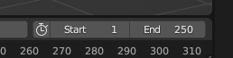

# Blender NewDark Motion Import/Export
Allows Blender to import and export Dark Engine (Thief/Thief 2, System Shock 2) motions, including flags.

## Itroduction
This Blender addon allows the user to import and export motions for the Dark Engine games. Motion flags are also supported, meaning various sounds, weapon effects (etc) can be triggered as the motion plays.

It can also import a .cal file, which gives you an AI skeleton structure but with no frames, which can help if you're starting a new motion from scratch.

## Credits
* This addon is based heavily on Telliamed's motion conversion Python scripts in the [Blender Toolkit](https://www.ttlg.com/forums/showthread.php?t=136431). Much of the code is unchanged. The main differences are the integration into a Blender addon.
* Weyoun's Motion Editor already has support for flags, so it's a useful way of verifiying that this addon is also handling them correctly. 
* For the motion flag support, Firemage deserves credit for providing info about the .mi file structure, and working out the purpose of some of the motion flags. 
* The blenderartists user Gorgious came up with a way of [managing and showing those flags in Blender](https://blenderartists.org/t/unique-set-of-properties-per-frame/1467364/2) 
* Finally, this addon also makes use of Blenders existing BVH addon.

## Installation
### Blender Files
Go to the [Releases](https://github.com/RSoul82/Blender-NewDark-MotionIO/releases/tag/Release) page and download **Blender-NewDark-MotionIO.zip** 
**NO NEED TO UNZIP MANUALLY**

In Blender, go to Edit > Preferences > Addons then Install: 
 
This will install it into the correct folder.

**While you're in the Addons window, make sure the BVH addon is also enabled**

### Motion Files
Find you game's "crf" files and open **Mesh.crf** with a zip program (e.g. 7Zip). Extract all **.cal** and **.map** files to a folder of your choice. These are what the addon refers to as "Supporting Files". Copy the full path of this folder.

### Config file setup
When the addon is installed it will create a config file with some default values. In your file explorer go to %appdata%\Blender Foundation\Blender\ **version number here** \config\scripts and open **NewDarkMotionIO.cfg**

Edit the value of **supporting_files_dir** to point to where you extracted the files mentioned above. Note that you have to use pairs of back-slashes before each folder, and surround the whole thing with double quotes, e.g: "C:\\Users\\SomeGuyIDK\\Dromed\\Motions\\extra files"

#### Other Options
**auto_del_temp_bvh**: The addon creates a tempoary .bvh file when importing/exporting. By default it is deleted afte the process, but you can keep it around if you want. Do remember that you can also use the BVH exporter on its own if you want to use a Dark Engine motion in another program.

**max_motion_frames**: This value sets the total number of frames that allow motion flags to be set. The default of 10000 should be fine, but you can change it if you want. During development, some performance issues were noticed as the value increased. Some computers may struggle with the default value, so you can lower it too.

**IF YOU CHANGE THIS FILE, YOU WILL HAVE TO RESTART BLENDER FOR THE CHANGES TO APPLY**

## Importing
The import function shows up like this in the menu: 
 

Motion files can be extracted from **Motions.crf**. Each motion has two files: **.mi** and **.mc**, which probably mean "motion info" and "motion capture". The addon only needs the **.mi** file to be specified, and will assume this naming convention: **name.mi** and **name_.mc**.

The importer also allows **.cal** files to be imported, giving you a skeleton in the neutral pose, and not motions.

The import window gives you a few options. The middle two drop downs list all the **.cal** and **.map** files in your supporting files folder: 
 
The names of each set of files make it clear which pairs are compatible, but it will be up to you to ensure they match the motion that's being imported.

The defaults will be fine for most cases. For burricks and other creatures you will need to select the correct items.

**Known issue**: When importing a cal file, the .bvh importer generates an error, related to there not being any frames, and the temp file does not get deleted.

## Exporting
The export function shows up like this in the menu: 
 

There are a few options. The defaults will be fine for most cases: 
 
Once again, the list of **.map** files is generated by looking in the supporting files folder. The creature types list is defined in a couple of the addon's **.py** files. Make sure your choices are compatible with each other and with the skeleton whose motion is being exported.

# Flags!
This addon supports motion flags. When you first load Blender you will see this button in the 'Scene' properties: 

Clicking this button will create a set of blank flags for the first 10000 frames (as defined in the config file, see above), but this is only necessary when creating a motion from scratch. If you import a motion (**.mi** file), the flags will be generated *and filled in* automatically. Note that these are Blenders 10000 frames. If your own motion is 250 frames that's all that will be exported.

This is what you came here for: 
 
Click to set, click again to unset. At the bottom there are four buttons that can help to manage the flags:
* **Swap Prev**/**Swap Next**: Swaps the flags of the current frame with the flags of the previous or next frame. The decision to swap, rather than move, was made in order to ensure the flags from the other frame are kept instead of risking them being lost.
* **Clear This**: Sets all the flags of the current frame to false/unselected.
* **Clear All**: Same as above except it for **all frames**.

## Frame Start and Frame End
 
The addon will export all frames between the two numbers selected above (the BVH addon handles that). If you change the start frame, for example to export a short part of a longer motion, the flags will be assigned to the correct relative frame in the **.mi**/**.mc** file.

## Further Info
To make use of these motions you'll need to edit/create motion **schema files** and re-compile the **motion database**. The details are beyond the scope of this readme, but can get the necessary tools, files, and instructions from here:
* Shadowspawn's [**Motion Database Tools**](https://www.systemshock.org/index.php?topic=3092.0). Also much recommended is the **General Purpose Motion Database** on the same page, which is a very good base to start from.
