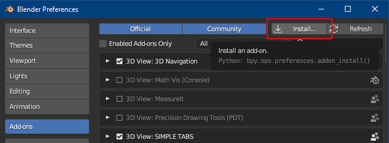

# Blender NewDark Motion Import/Export
Allows Blender to import and export Dark Engine (Thief/Thief 2, System Shock 2) motions, including flags.

## Itroduction
This Blender addon allows the user to import and export motions for the Dark Engine games. Motion flags are also supported, meaning various sounds, weapon effects (etc) can be triggered as the motion plays.

## Credits
This addon is based heavily on Telliamed's motion conversion Python scripts in the [Blender Toolkit](https://www.ttlg.com/forums/showthread.php?t=136431)
Much of the code is unchanged. The main differences are the integration into a Blender addon.
For the motion flag support, Firemage deserves credit for providing info about the .mi file structure, and the blenderartists user Gorgious came up with a way of [managing and showing those flags in Blender](https://blenderartists.org/t/unique-set-of-properties-per-frame/1467364/2)

## Installation
Go to the [Releases](https://github.com/RSoul82/Blender-NewDark-MotionIO/releases/tag/Release) page and download **Blender-NewDark-MotionIO.zip**
**NO NEED TO UNZIP MANUALLY**

In Blender, go to Edit > Preferences > Addons then Install: 
 
This will install it into the correct folder.

